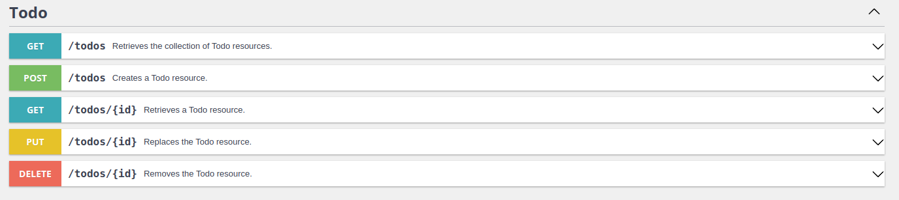

<br/>
<p align="center">
  <a href="https://github.com/komandar/todo-api-app">
    
  </a>

  <h3 align="center">ToDo List API Platform</h3>
</p>

## Table Of Contents

* [About the Project](#about-the-project)
* [Built With](#built-with)
* [Getting Started](#getting-started)
    * [Prerequisites](#prerequisites)
    * [Installation](#installation)
* [Testing](#testing)
* [Todo](#todo)
* [Contributing](#contributing)
* [License](#license)

## About The Project



This project is intended to provide users with the API functionality of a todo project (similar to Wunderlist, Todoist, etc.). Using Symfony's API platform, API queries can also be performed via the GUI.

Currently, the platform offers the following API endpoints:

* `GET /todos` Return a list of all Todos
* `POST /todos` Create a new todo
* `GET /todos/{id}` Return a selected todo by means of an ID
* `PUT /todos/{id}` Overwrites an existing Todo
* `DELETE /todos/{id}` Deletes a Todo

### Important

Due to the use of the current Symfony version (6.1.x) in conjunction with the Codeception Module, it was necessary to raise the "minimum-stability" flag in the composer.json file. As soon as an update is available, the value can be changed back to "stable".

(!)The project is only a POC (proof of concept) and cannot/should not be used productively at the current state.

## Built With

The project is based on the current non-lts version of the PHP framework Symfony and includes various tools to ensure code quality such as PHP Code Sniffer, PHP Mess Detector and PHP Stan as well as for testing Codeception.

## Getting Started

### Prerequisites

The Symfony CLI, Docker and docker compose v2 must be installed on the client computer.
A more detailed guide for the Symfony CLI installation can be found [here](https://symfony.com/download). For Debian/Ubuntu the installation takes place as follows:

```sh
echo 'deb [trusted=yes] https://repo.symfony.com/apt/ /' | sudo tee /etc/apt/sources.list.d/symfony-cli.list
sudo apt update
sudo apt install symfony-cli
```

### Installation

1. Clone repository

```sh
git clone git@github.com:komandar/todo-api-app.git
cd todo-api-app
```

2. Install composer dependencies

```sh
composer install
```

3. Start database server

```sh
docker compose up -d
```

4. Setup database and load fixtures

```sh
symfony console doctrine:database:create
symfony console doctrine:migrations:migrate
symfony console doctrine:fixtures:load
```

4. Start symfony webserver

```sh
symfony serve
```

Open your web browser (default: [http://127.0.0.1:8000/](http://127.0.0.1:8000/)) or use Postman/Curl to make api calls.

## Testing

The project is based on the Codeception test framework. The test cases can be executed using the following commands:

```sh
# api tests
vendor/bin/codecept run Api
```

## Todo

The following things are planned for later versions:

* Create todo platform for users
* Optimize PHPMD, PHPCS, PHPStan, PHPUnit configurations
* Extend test coverage
* Integrate tools like Codecov, etc.
* More detailed documentation
* Create small CI/CD using GitHub Action

## Contributing

1. Fork the Project
2. Create your Feature Branch (`git checkout -b feature/AmazingFeature`)
3. Commit your Changes (`git commit -m 'Add some AmazingFeature'`)
4. Push to the Branch (`git push origin feature/AmazingFeature`)
5. Open a Pull Request

## License

Distributed under the MIT License. See [LICENSE](https://github.com/komandar/todo-api-app/blob/main/LICENSE.md) for more information.
